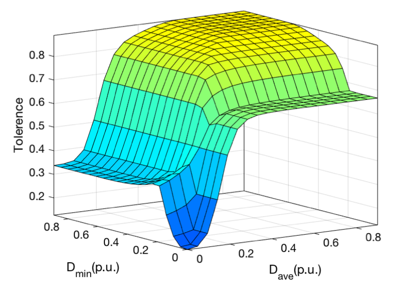

Voltage sag has been considered one of the most critical power quality problems affecting electrical equipment's normal operations. This event further leads to excessive investment or short prevention and control capabilities, resulting in more significant losses.

This project develops an online monitoring system for voltage sags; The development includes extraction, classification, and identification of different voltage sag sources. Meanwhile, the project also evaluates the severity of voltage sags in various events quantitatively. We aim to detect voltage sag source monitorability and precise fault location for different substations and regional power grids. For other types of power-sensitive users, the online monitoring and analysis of voltage sags, power generation side, and user side are the key points for improving the quality of power supply to sensitive power users, reducing unnecessary investment, and improving system stability.

Here, we presented a bi-level optimal allocation for voltage-sag monitors to consider fault locating and disturbance tolerance ability. In the first level, a binary linear programming model is proposed for both symmetrical and asymmetrical faults. A binary gravity search algorithm (BGSA) is applied for solving the binary optimization problem. In the second level, to select the optimal allocation among all feasible solutions, the disturbance tolerance ability is modeled and quantified based on fuzzy inference. Allocation-level disturbance tolerance indexes are then obtained to determine the ultimate monitoring allocation. The IEEE 39-bus test system is used for the validation of the proposed method.

As an example, the numerical presentation of the applied Mamdani inference model is as follows.

